# Altynx | Fintech Core
### High-Performance Banking and Fraud Intelligence Ecosystem

---

  

```mermaid
graph LR
    %% Advanced CSS Styling for Smoothness and Color
    classDef userGateway fill:#0f172a,stroke:#38bdf8,stroke-width:2px,color:#fff,rx:20,ry:20;
    classDef coreApp fill:#1e1b4b,stroke:#818cf8,stroke-width:2px,color:#fff,rx:20,ry:20;
    classDef aiEngine fill:#4c0519,stroke:#f43f5e,stroke-width:2px,color:#fff,rx:20,ry:20;
    classDef cloudInfra fill:#064e3b,stroke:#34d399,stroke-width:2px,color:#fff,rx:20,ry:20;
    classDef dataLayer fill:#422006,stroke:#fb923c,stroke-width:2px,color:#fff,rx:20,ry:20;
    
    %% Link Styling (Sleek grey paths)
    linkStyle default stroke:#64748b,stroke-width:2px,fill:none;

    %% Free-floating Nodes with Icons (No Grey Boxes)
    Client(["fa:fa-mobile-screen User App"]):::userGateway
    API(["fa:fa-network-wired API Gateway"]):::userGateway
    Auth(["fa:fa-shield-halved Security"]):::userGateway
    
    NET(["fa:fa-code .NET 8 Microservices"]):::coreApp
    Ledger(["fa:fa-book-journal-whills Distributed Ledger"]):::coreApp
    
    Fraud(["fa:fa-brain Neural Fraud Engine"]):::aiEngine
    RAG(["fa:fa-chart-network RAG Pipeline"]):::aiEngine
    
    K8s(["fa:fa-dharmachakra Kubernetes"]):::cloudInfra
    AWS(["fa:fa-cloud Multi-Cloud"]):::cloudInfra
    
    CRM(["fa:fa-users Salesforce CRM"]):::dataLayer
    Vault(["fa:fa-lock Encrypted Vault"]):::dataLayer

    %% Flow Path Connections
    Client == "HTTPS" ==> API
    API -. "Token" .-> Auth
    API ==> NET
    NET ==> Ledger
    Ledger ==> Fraud
    Fraud -. "Live Stream" .-> RAG
    NET ==> K8s
    K8s ==> AWS
    RAG ==> CRM
    AWS ==> Vault
    CRM ==> Vault
```

This repository serves as a mission-critical engineering showcase by **Altynx**. It demonstrates a unified approach to modern financial technology, integrating high-concurrency architecture, neural intelligence, and cloud-native resilience.

---

### 1. Custom Software Engineering
**Core Banking Engine**

   

Distributed microservices engine engineered for high-volume transaction processing and intelligent API orchestration.

### 2. AI and Neural Frameworks
**Fraud Detection and Intelligence**

   

Real-time monitoring systems utilizing proprietary neural architectures and RAG-enhanced diagnostic pipelines for anomaly detection.

### 3. Cloud and Infrastructure Engineering
**Resilience at Scale**

   

SRE-governed infrastructure optimized for 99.99% uptime with cross-regional multi-cloud failover and automated resource scaling.

### 4. DevOps and Automation Excellence
**Operational Excellence**

   

End-to-end automated deployment pipelines with integrated security protocols and immutable infrastructure management.

### 5. Web and Mobile App Engineering
**Unified User Interface**

   

High-velocity financial dashboards and mobile applications designed for real-time asset management and high-frequency data visualization.

### 6. CRM and Data Intelligence
**Strategic Customer Insights**

  

Centralized data ecosystems feeding into custom CRM integrations for automated, intelligence-driven customer lifecycles.

### 7. Elite Staff Augmentation
**Squad Deployment**

  

Rapidly scalable engineering squads integrated directly into client environments to maintain project velocity and technical excellence.

---

### Legal and Intellectual Property
Copyright © 2026 **Altynx**. All rights reserved. 

The architecture, code patterns, and methodologies contained within this repository are the exclusive proprietary property of Altynx. This material is provided for technical review and portfolio demonstration purposes only. Unauthorized reproduction is prohibited.

---
### Contact Information
Inquiries: [info@altynx.com](mailto:info@altynx.com)  
Official Website: [altynx.com](https://altynx.com)
